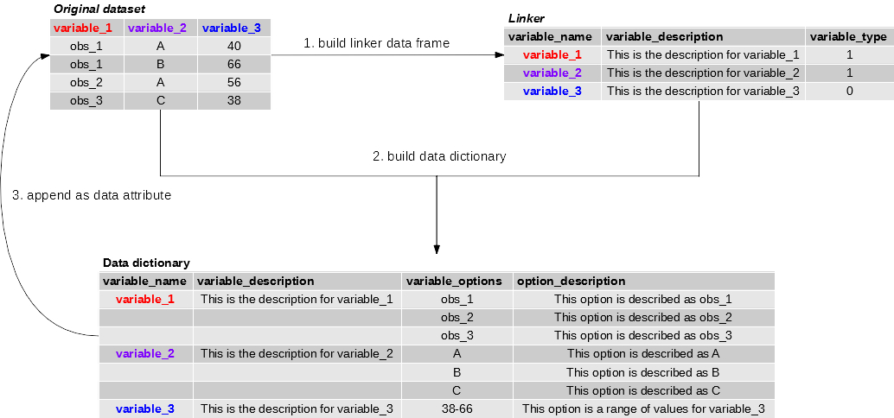

```{r echo=F, message=F, warning=F}
library(dataMeta)
library(knitr)
options(width = 110)
opts_chunk$set(size = 'small', comment = NA, tidy = FALSE)
```

## Introduction  
  
  Datasets generally require a data dictionary that will incorporate information related to the dataset's variables and their descriptions, including the description of any variable options. This information is crucial, particularly when a dataset will be shared for further analyses. However, constructing it may be time-consuming. The `dataMeta` package has a collection of functions that are designed to construct a data dictionary and append it to the original dataset as an attribute, along with other information generally provided in other software as metadata. This information will include: the time and date when it was edited last, the user name, a main description of the dataset. Finally, the dataset is saved as an R dataset (.rds).
  
  There are three basic steps to building a data dictionary with this package, which are outlined in the figure below. First, a "linker" data frame is created, where the user will add each variable description and also provide a variable "type" or key. These keys/variable types are explained below. The variable type will depend on whether the user wants to list all available variable options or if a range of variable values would suffice. Secondly, the main data dictionary is created using the original dataset and the linker data frame. Here, the user will be able to construct any additional variable option descriptions as needed or just build a dictionary with variable names, their descriptions and options. Finally, the user can append the dictionary to the original dataset as an R attribute, along with the date in which the dictionary is created, the author name, and also general R attributes included for data frames.  The new dataset with its attributes is then saved as an R dataset (.rds).  
  
&nbsp;  
  
```{r echo = FALSE, out.width = "800px", fig.align = 'center'}

```  
  
&nbsp;  
  
### Data  
  
  The data used for this vignette will be obtained from the Centers for Disease Control and Prevention (CDC) github repository for publicly avaiable Zika data: https://github.com/cdcepi/zika. This repo contains Zika data that has been scraped from the published records of the Health Department of various countries. The dataset used contains information related with Zika infection in the United States Virgin Islands (USVI) as published by their Health Department on their [January 03, 2017 report](http://doh.vi.gov/assets/documents/2017/010317_ZikaReport.pdf) and can be obtained using the code below. Please, note that the data is read with `stringsAsFactors = FALSE`.  Below is a portion of this dataset:  
  
```{r message = FALSE, warning = FALSE}
data(my.data)

kable(head(my.data, 10), format = "html", caption = "Portion of dataset")
```  
  
&nbsp;  
  
  Another way to load the data is using it's raw link from the github repo where it is stored:  
  
```{r eval = FALSE, message = FALSE, warning = FALSE}
path = "http://raw.githubusercontent.com/cdcepi/zika/master/"
path2 = "USVI/USVI_Zika/data/USVI_Zika-2017-01-03.csv"
url <- paste0(path, path2, collapse="")

my.data <- read.csv(url, header = TRUE, stringsAsFactors = FALSE)
```  
  
\newpage  
## Data Dictionary  
  
### Linker:
  
  To build a data dictionary for the previous dataset, a linker data frame is constructed. This linker will serve as an intermediary to build the data dictionary. It will contain the names of the variables, a description of each variable provided by the user and a "variable type."  The variable type will give each variable a value of `1` or `0`, as follows:  
  
  + `0`: for those variables that have options that can be portrayed as a range of values. For example, age or dates or any categorical factors that the user does not want to list out (NA values will be maintained).  
  + `1`: for those variables that have options that need to be listed and/or descrcibed later on.  
  
The linker is built using one of the following two functions:  
  
  + `prompt_linker.R` will prompt the user to add the description of each variable in the console and the variable type.  
  + `build_linker.R` will require that the user create two vectors that will fill out the variable descriptions and variable types. This is shown below:  
  
&nbsp;  
  
```{r warning = FALSE, message = FALSE}
var_desc <- c("Date when report was published", "Regional location", 
             "Description of regional location", "Type of case",
             "A specific code for each data field", "The time period of each week",
             "The type of time period", "The number of cases per data field type",
             "The unit in which cases are reported")

var_type <- c(0, 1, 0, 1, 0, 0, 0, 0, 1)
                          
linker <- build_linker(my.data, variable_description = var_desc, variable_type = var_type)
```
  
  The linker dataframe will look like this:  
```{r warning = FALSE, message = FALSE, echo = FALSE}
kable(linker, format = "html", caption = "Linker data frame")
```  
  
\newpage  
### Dictionary build:  
  
  Next, the dicitonary is built using the linker created above and the original dataset using the `build_dict`. Here, `option_description` is set to `NULL` because the options of each variable are self explanatory, thus the dictionary will not contain a description for each variable option. If `option_descriptions` will be added, then a vector of each option description is constructed. The length of this vector needs to be the same as the number of rows in the dictionary and it will depend on the the `variable_type` used in the linker. Another way to add option descriptions is to use the `prompt_varopts` function, which prompt the user for a description of each variable option, without the need to write the descriptions vector beforehand. If using this option, then `prompt_varopts` must be set to `TRUE` and `option_description` must be `NULL`. The following code builds a data dictionary for the USVI report:  
  
&nbsp;  
  
```{r warning = FALSE, message = FALSE}
dict <- build_dict(my.data = my.data, linker = linker, option_description = NULL, 
                   prompt_varopts = FALSE)
```  
  
  The dictionary will look as follows:  
  
```{r warning = FALSE, message = FALSE}
kable(dict, format = "html", caption = "Data dictionary for original dataset")
```  
  
&nbsp;  
  
### Adding the dictionary as a data attribute and incorporating other attributes:  
  
  To add the dictionary as an attribute to the original dataset, the function `incorporate_attr` is used. This function will require that the user add a main description of the dataset as shown below. There is also a `prompt_attr` function that will prompt the user to add this description through the console. Once the attributes are added to the dataset, the function `save_it` will save the file as an R data file `.rds`, which will preserve all attributes to the dataset.  Accessing the attributes of the data is done using the following comand: `attributes(my.new.data)` and single attributes, like the main description of the dataset, can be obtained by typing: `attributes(my.new.data)$main`, as is shown below:  
  
&nbsp;  
  
```{r warning = FALSE, message = FALSE}
data_desc = "This data set portrays Zika infection related cases as reported by USVI."

my.new.data <- incorporate_attr(my.data = my.data, data.dictionary = dict, main_string = data_desc)

attributes(my.new.data)
```  
  
&nbsp;  
  
  The user can also export the data dicitonary using as .csv or .xlsx by itlself and also save the data with all of its attributes, as shown below:

```{r warning=F, message=F, eval=F}
# Exporting dictionary only:
dict_only <- attributes(my.new.data)$dictionary
write.csv(dict_only, "dict_only.csv")

# Saving as .rds (dataset with appended dictionary)
save_it(complete_dict = my.new.data, name_of_file = "My Complete Dataset")
```  
  
&nbsp;  
  
## References  
  
  1. Dania M. Rodriguez, Michael A Johansson, Luis Mier-y-Teran-Romero, moiradillon2, eyq9, YoJimboDurant, … Daniel Mietchen. (2017). cdcepi/zika: March 31, 2017 [Data set]. Zenodo. http://doi.org/10.5281/zenodo.439543